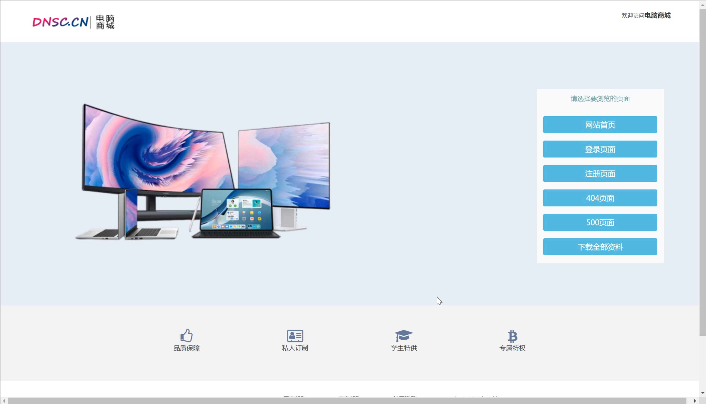
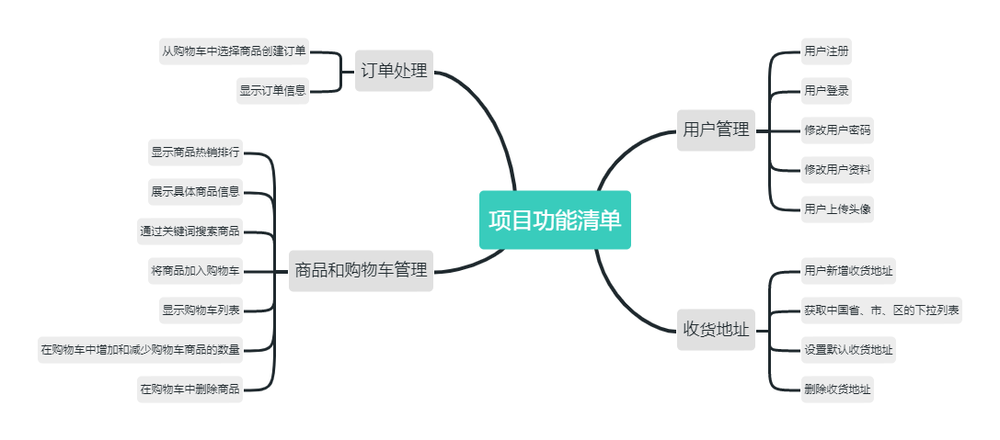

# A B2C Online Store based on SpringBoot
Author: Guangqi Jiang (leader), Yongqi Fan, Peizhao Li @SCU

## Technical Roadmap
- **database:** MySQL + Navicat
- **Server:** SpringBoot 2.4.7 + MyBatis 2.1.4 + AJAX
- **Frontend:** HTML + JavaScript + CSS + Bootstrap
- **Java:** JDK 8+
- **Project Management Tool:** Maven 3.6.3
- **Projec Dev Tool:** IntelliJ IDEA Ultimate 2020.3.2 x64
- **Browser:** Google Chrome, MicroSoft Edge etc.

## Quickstart
For a quickstart, please refer to the link in the Acknowledgement section at the bottom of this file.

## Functional Requirements
We involved several functional requirements as listed below.
### Order Processment
- Select products from shopping cart and create an order
- Show details of orders
### User Management
- User registration
- User login
- Change pwd
- Modify personal info
- Upload avatar
### Product and Shopping Cart Management
- Show the ranking of hot products
- Show details of a certain product
- Search for products by key
- Add products to the shopping cart
- Show shopping cart
- Increase or decrease the number of products in the shopping cart
- Remove products from the shopping list
### User Address
- Add user addresses
- Get the infomation of province, city and district in China
- Set default address
- Delete addresses

All the functions are shown in the following picture in Chinese:

## Database Design
Here is our database design (underline indicates primary key):\
user(<ins>uid</ins>, username, password, salt, phone, email, gender, avatar, is_delete, created_user, created_time, modified_user, modified_time)\
product(<ins>pid</ins>, item_type, title, sell_point, price, num, image, status, priority, created_time, created_user, modified_time, modified_user)\
category(<ins>ID</ins>, parent_id, name, status, sort_order, is_parent, created_time, modified_time, created_user, modified_user)\
address(<ins>aid</ins>, province_name, province_code,city_name,city_code,area_name,area_code, zip, address, phone, tel, tag, is_default, created_user, created_time ,modified_user, modified_time )\
order(<ins>oid</ins>, uid, aid, status, total_price, pay_time, created_time, create_user, modified_time, modified_user)\
cart(<ins>uid</ins>, product, price,num, created_time, created_user, modified_time, modified_user )\
user_address(<ins>uid, aid</ins>)\
order_item(<ins>oid, pid</ins>)\
Product_category(<ins>pid, ID</ins>)

## Other resources
We provide our final demo video in this repository.

## Acknowledgement
Our project refers this video tutorial on Bilibili: https://www.bilibili.com/video/BV1bf4y1V7Bx/?share_source=copy_web&vd_source=d0c35bd945166518afac48af8599f9c1. Based on this codebase, we added our own elements.